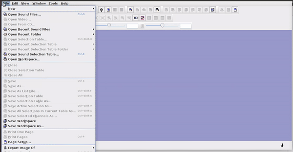
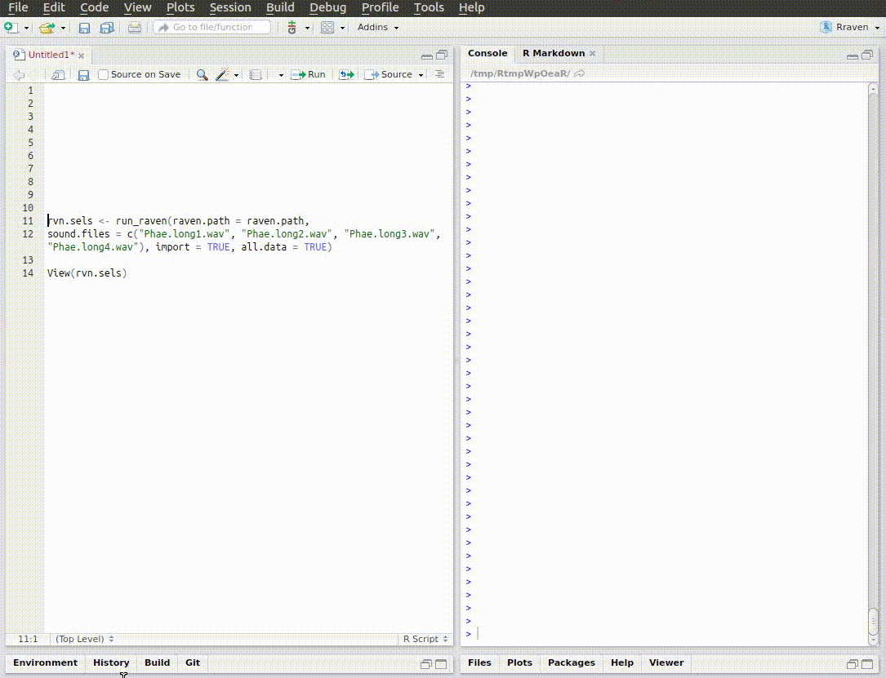

&nbsp; 


## Annotation tables

An annotation table (or selection table in Raven's terminology and **warbleR**) is a spreadsheet that contains information about the location (and frequency) of the sounds of interest in one or more sound files. Therefore, the basic annotation table should contain at least 3 columns:

```{r, echo = FALSE}

library(kableExtra)

options(digits=3)

start <- rnorm(n = 4, mean = 3)
end <- start + abs(rnorm(n = 4, mean = 1))

cd.anot <- data.frame(sound.files = rep(c("sound_file_1.wav", "sound_file_2.wav"), each = 2), start, end) 

kbl <- kable(cd.anot, align = "c", row.names = F,  format = "html")

kbl <-  kable_styling(kbl, bootstrap_options = "striped", font_size = 14)

kbl

```

&nbsp; 

Ideally we should also include the frequency range of the annotations:

```{r, echo = FALSE}

cd.anot$bottom.freq <- rnorm(n = 4, mean = 5)
cd.anot$top.freq <- rnorm(n = 4, mean = 9)

kbl <- kable(cd.anot, align = "c", row.names = F,  format = "html")

kbl <-  column_spec(kbl, 4:5, background = "#ccebff")

kbl <-  kable_styling(kbl, bootstrap_options = "striped", font_size = 14)

kbl

```

&nbsp; 

.. and a unique identifier (at least within each sound file) for each annotation:

```{r, echo = FALSE}

cd.anot$selec <- rep(1:2, 2)

cd.anot <- cd.anot[, c(1, 6, 2:5)]

kbl <- kable(cd.anot, align = "c", row.names = F,  format = "html")

kbl <-  column_spec(kbl, 2, background = "#ccebff")

kbl <-  kable_styling(kbl, bootstrap_options = "striped", font_size = 14)

kbl

```

Finally, for sound files with multiple channels, the annotation table should indicate in which channel the sound of interest is located:

```{r, echo = FALSE}

cd.anot$channel <- rep(1, 4)

cd.anot <- cd.anot[, c(1, 7, 2:6)]

kbl <- kable(cd.anot, align = "c", row.names = F,  format = "html")

kbl <-  column_spec(kbl, 2, background = "#ccebff")

kbl <-  kable_styling(kbl, bootstrap_options = "striped", font_size = 14)

kbl

```

&nbsp; 

This format, with the same column names as in the previous example, is the one used by the **warbleR** package as a basic data object to work on batches of sounds ("batches"). The mandatory columns are "sound.files", "selec", "start", and "end". The frequency range columns ("bottom.freq" and "top.freq") and the channel number ("channel") are optional.

Annotation tables can be generated within R, or imported from sound analysis programs (mainly, Raven, Avisoft, Syrinx and Audacity).


## viewSpec (**monitoR**)

The `viewSpec()` function of **monitoR** allows you to annotate 'wave' objects or sound files interactively. For this, the argument `annotate = TRUE` must be defined. When running it shows the commands that control the function:

```{r, eval = FALSE, echo = TRUE}

library(monitoR)

data(tico, package = "seewave")

viewSpec(tico, annotate = TRUE, ovlp = 90)

```


&nbsp; 

The commands allow you to zoom, specify the time and frequency range of the sounds and add notes:


&nbsp;

The annotations are saved in '.csv' format upon exiting the function (name must be provided).

&nbsp;

## Audacity

**Audacity** is a free access program that allows you to manipulate sound files. It can be downloaded at [this link](https://www.audacityteam.org/download/).

&nbsp; 


<!--  -->

&nbsp; 

**Audacity** is quite rigid to create annotation tables, although it can be useful when working with long recordings. Text files generated by **Audacity** can be imported to R using the `read.table()` function.

&nbsp;

<div class="alert alert-info">

<font size="5">Exercise</font> 

&nbsp;

- Annotate 1 sound file from the "./examples" folder using **Audacity** 

&nbsp;

- Import the annotation file into R using seewave's `read.audacity()`

</div>

&nbsp;

## Raven

[Raven sound analysis software](http://www.birds.cornell.edu/brp/raven/RavenOverview.html)  ([Cornell Lab of Ornithology](http://www.birds.cornell.edu)) provides very powerful tools for the analysis of sounds (animals).
**Raven** allows you to use the cursor to manually define the frequency and time limits of the signals. It is a very flexible and user friendly program. The annotations can be saved in a selection file (selection table) in .txt format:

&nbsp; 


&nbsp; 

Selections can be reopened on the original file where they were made:

&nbsp; 


&nbsp; 

The selections with sound (sound selection table) are a special type of annotation that contains all the information about the address of the files and allows to be opened directly without opening the sound file first. To create these selections, you must include the 'Begin File', 'Begin Path' and "File offset (s) 'columns (the latter only if the file contains annotations for more than one sound file):

&nbsp;


&nbsp;

These selections open easily in Raven, as long as the sound files are kept in the original folders:

&nbsp; 



&nbsp; 


## Rraven

&nbsp; 

The **Rraven** package is designed to facilitate data exchange between R and [Raven sound analysis software](http://www.birds.cornell.edu/brp/raven/RavenOverview.html). R can simplify the automation of complex analysis routines. In addition, R packages such as **warbleR**, **seewave** and **monitorR** (among others) provide additional methods of analysis, which work as a perfect complement to those found in Raven. Therefore, bridging these applications can greatly expand the bioacoustic toolkit.    

Currently, most Raven analyzes cannot be run in the background from a command terminal. Therefore, most of the **Rraven** functions are designed to simplify the exchange of data between the two programs, and in some cases, export files to Raven for further analysis. This tutorial provides detailed examples for each function in **Rraven**, including both the R code and the additional steps required to fully conduct the analyses. Raven Pro must be installed in order to run some of the code.

In this link you will find several videos that show in detail the different tools in Raven.

http://ravensoundsoftware.com/video-tutorials/

&nbsp;


## Import Raven data

### *imp_raven*

This function imports Raven selection tables. You can import several files at once. Raven can also import selection tables that include data from multiple recordings. The function returns a single data frame with the information contained in the selection files. We already have 4 Raven selection tables in the example directory:

```{r, eval=T, echo=T}

list.files(path = "./examples", pattern = "\\.txt$")

```
 &nbsp; 


This code shows how to import all the data contained in those files into R:

```{r, eval=FALSE}

rvn.dat <- imp_raven(all.data = TRUE, path = "./examples")

head(rvn.dat)

```

```{r, eval=TRUE, echo=F, message=F}

library(Rraven)

rvn.dat <- imp_raven(all.data = TRUE, path = "./examples")

kbl <- kable(head(rvn.dat), align = "c", row.names = F, escape = FALSE) 

kbl <- kable_styling(kbl, bootstrap_options = c("striped", "hover", "condensed", "responsive"), full_width = FALSE, font_size = 11)

scroll_box(kbl, width = "808px",
box_css = "border: 1px solid #ddd; padding: 5px; ", extra_css = NULL)

```
 &nbsp; 
 
Note that the 'waveform' view data has been deleted. It can also be imported as follows (but note that the example selection tables do not have waveform data):

```{r, eval=FALSE}

rvn.dat <- imp_raven(all.data = TRUE, waveform = TRUE, path = "./examples")

```
&nbsp; 
 
Raven selections can also be imported in 'selection.table' format so that you can input directly into **warbleR** functions. To do this, you only need to set `warbler.format = TRUE`:

```{r, eval=FALSE}

rvn.dat <- imp_raven(all.data = FALSE, freq.cols = TRUE, path = "./examples", warbler.format = TRUE, all.data = FALSE)

head(rvn.dat)

```

```{r, eval=TRUE, echo=FALSE}

rvn.dat <- imp_raven(warbler.format = TRUE, all.data = FALSE, freq.cols = TRUE, path = "./examples/")

kbl <- kable(head(rvn.dat), align = "c", row.names = F, escape = FALSE)

kable_styling(kbl, bootstrap_options = c("striped", "hover", "condensed", "responsive"), full_width = TRUE, font_size = 12)

# scroll_box(kbl, width = "808",
# box_css = "border: 1px solid #ddd; padding: 5px; ", extra_css = NULL)
```
 &nbsp; 
 
The output data frame contains the following columns: "sound.files", "channel", "selec", "start", "end" and "selec.file." You can also import the frequency range parameters in 'selection.table' by setting 'freq.cols' tp `TRUE`. The data frame returned by `imp_raven()` (when in the **warbleR** format) can be entered into several functions of **warbleR** for a more detailed analysis.

### *relabel_colms*

This is a simple function to re-label the columns to match the format of the selection table used in **warbleR**:

```{r, eval = F, echo = T}

# para simplificar solo las primeras 7 columnas
st1 <- rvn.dat[ ,1:7]

st1
```

```{r, eval = T, echo = F}

#to simplify the example select a subset of the columns 
st1 <- rvn.dat[ ,1:7]

#check original column names
kbl <- kable(st1, align = "c", row.names = F, escape = FALSE) 

kbl <- kable_styling(kbl, bootstrap_options = c("striped", "hover", "condensed", "responsive"), full_width = FALSE, font_size = 14)

```


```{r, eval = F, echo = T}

relabel_colms(st1)

```

```{r, eval = T, echo = F}
rc <- relabel_colms(st1)

kbl <- kable(rc, align = "c", row.names = F, escape = FALSE) 

kbl <- kable_styling(kbl, bootstrap_options = c("striped", "hover", "condensed", "responsive"), full_width = FALSE, font_size = 14)

```
 &nbsp; 

Additional columns can also be re-labeled:

```{r, eval = F, echo = T}

relabel_colms(st1, extra.cols.name = "View",
              extra.cols.new.name = "Raven view")

```

```{r, eval = T, echo = F}

rc <- relabel_colms(st1, extra.cols.name = "View",
 "Raven view")

kbl <- kable(rc, align = "c", row.names = F, escape = FALSE) 

kable_styling(kbl, bootstrap_options = c("striped", "hover", "condensed", "responsive"), full_width = FALSE, font_size = 14)

```
 &nbsp; 

 
## Export R data to Raven

### *exp_raven*

*exp_raven* saves a selection table in '.txt' format that can be opened directly in Raven. No objects are returned to the R environment. The following code exports a selection table from a single sound file:

```{r, eval=FALSE, echo=T}

st1 <- lbh_selec_table[lbh_selec_table$sound.files == "Phae.long1.wav",]

exp_raven(st1, file.name = "Phaethornis 1", khz.to.hz = TRUE)
```
 &nbsp; 
 
If the path to the sound file is provided, the functions export a 'sound selection table' that can be opened directly by Raven (and which will also open the associated sound file):

```{r, eval=FALSE, echo=T}

st1 <- lbh_selec_table[lbh_selec_table$sound.files == "Phae.long1.wav",]

exp_raven(st1, file.name = "Phaethornis 1", khz.to.hz = TRUE, sound.file.path = "./examples")

```


&nbsp; 

This is useful for adding new selections or even new measurements:


&nbsp;

If there are several sound files available, users can export them as a single selection file or as multiple selection files (one for each sound file). This example creates a multiple selection of sound files:

```{r, eval=FALSE, echo=T}

exp_raven(X = lbh_selec_table, file.name = "Phaethornis multiple sound files", 
sound.file.path = "./examples", single.file = TRUE)
```

&nbsp; 

These types of tables can be opened as a multi-file display in Raven:


&nbsp;

---

## Running Raven from R

### *run_raven*

The function opens multiple sound files simultaneously in Raven. When the analysis is completed (and the Raven window is closed) the data can be automatically re-imported to R using the 'import' argument. Note that Raven, unlike R, can also handle files in the format 'mp3', 'flac' and 'aif':

```{r, eval=FALSE, echo=T}
# remplace con la direccion en su computadora
raven.path <- "DIRECCION_A_LA_CARPETA_DE_RAVEN AQUI" 

run_raven(raven.path = raven.path, sound.files = c("Phae.long1.wav", "Phae.long2.wav", "Phae.long3.wav", "Phae.long4.wav"), import = TRUE, 
 all.data = TRUE)  

``` 



&nbsp;


<div class="alert alert-info">

<font size="5">Exercise</font> 

&nbsp;

- Annotate 2 sound files from the "./examples" folder using **Raven**

&nbsp;

- Import the annotation files into R using Rraven's `imp_raven()`

&nbsp;

- Annotate the sound files again but this time adding some acoustic measurements to the annotation

&nbsp;

- Import the new annotation into R, including all **Raven** measurements

</div>

&nbsp;


---

## References

  - Araya-Salas (2017), *Rraven: connecting R and Raven bioacoustic software*. R package version 1.0.2.

---
 &nbsp; 
 
<font size="4">Session information</font>

```{r session info, echo=F}

sessionInfo()

```
