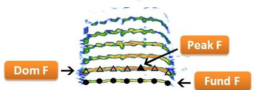

 

<b>Bioacoustic Analysis in R</b>

<b><a href="https://tropicalstudies.org/">Organization for Tropical Studies</a> </b>

<i>
<b><a href="marceloarayasalas.weebly.com/">Marcelo Araya-Salas, PhD</a> </b>
</i>

May 15 - 19, 2023

&nbsp; 

The study of animal acoustic signals is a central tool for many fields
in behavior, ecology, evolution and biodiversity monitoring. The
accessibility of recording equipment and growing availability of
open-access acoustic libraries provide an unprecedented opportunity to
study animal acoustic signals at large temporal, geographic and
taxonomic scales. However, the diversity of analytical methods and the
multidimensionality of these signals posts significant challenges to
conduct analyses that can quantify biologically meaningful variation.
The recent development of acoustic analysis tools in the R programming
environment provides a powerful means for overcoming these challenges,
facilitating the gathering and organization of large acoustic data sets
and the use of more elaborated analyses that better fit the studied
acoustic signals and associated biological questions. The course will
introduce students on the basic concepts in animal acoustic signal
research as well as hands-on experience on analytical tools in R.

### Objetive

Training biological science students and researchers in the detection and analysis of animal sounds in R. Specifically, it seeks to familiarize participants with computational tools in the R environment aiming at curating, detecting and analyzing animal acoustic signals, with an especial focus on quantifying fine-scale structural variation. The course will introduce the most relevant acoustics concepts to allow a detailed understanding of the metrics used for characterize acoustic signals. It will also guide participants through a variety of R packages for bioacoustics analysis, including seewave, tuneR, warbleR and baRulho. 

