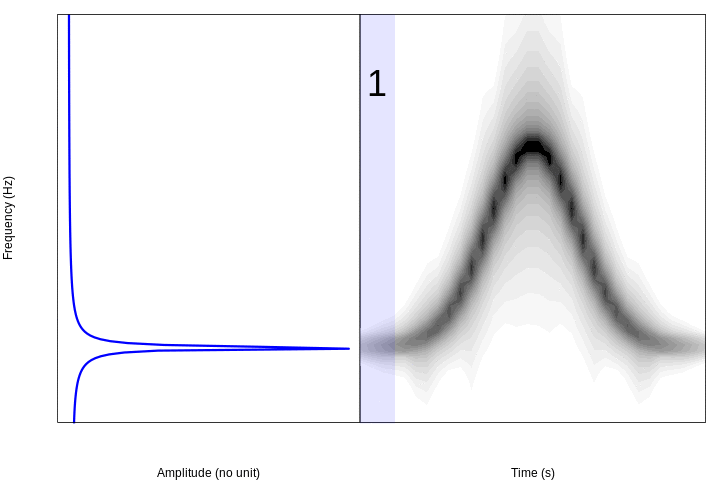
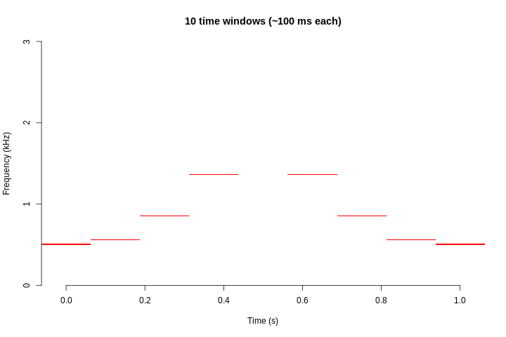

```{r, echo = FALSE}
library(knitr)

opts_chunk$set(tidy = TRUE, warning = FALSE, message = FALSE)

```

&nbsp; 


The spectrogram is a fundamental tool in the study of acoustic communication in vertebrates. They are basically a visual representation of the sound where the variation in energy (or power spectral density) is shown on both the frequency and the time domains. Spectrograms allow us to visually explore acoustic variation in our study systems, which makes it easy to distinguish structural differences at small temporal/spectral scales that our ears cannot detect.

We will use the **seewave** package and its sample data:

```{r, echo=TRUE, warning=FALSE, message=FALSE}

library(seewave)

# load examples
data(tico)

data(orni)

```


## Fourier transformation

In order to understand the information contained in a spectrogram it is necessary to understand, at least briefly, the [Fourier transformation](https://en.wikipedia.org/wiki/Fourier_transform). In simple words, this is a mathematical transformation that detects the periodicity in time series, identifying the different frequencies that compose them and their relative energy. Therefore it is said that it transforms the signals from the time domain to the frequency domain.

To better understand how it works, we can simulate time series composed of pre-defined frequencies. In this example we simulate 3 frequencies and join them in a single time series:

```{r}
# freq
f <- 11025

# time sequence
t <- seq(1/f, 1, length.out=f)

# period
pr <- 1/440
w0 <- 2 * pi/pr

# frec 1
h1 <- 5 * cos(w0*t)

plot(h1[1:75], type = "l", col = "blue", xlab = "Time (samples)", ylab = "Amplitude (no units)")

# frec 2
h2 <- 10 * cos(2 * w0 * t)

plot(h2[1:75], type = "l", col = "blue", xlab = "Time (samples)", ylab = "Amplitude (no units)")

# frec 3
h3 <- 15 * sin(3 * w0 * t)

plot(h3[1:75], type = "l", col = "blue", xlab = "Time (samples)", ylab = "Amplitude (no units)")

```

This is what the union of the three frequencies looks like:

```{r}
H0 <- 0.5 + h1 + h2 + h3

plot(H0[1:75], type = "l", col = "blue", xlab = "Time (samples)", ylab = "Amplitude (no units)")

```

Now we can apply the Fourier transform to this time series and graph the frequencies detected using a periodogram:

```{r}

fspc <- Mod(fft(H0))

plot(fspc, type="h", col="blue",
xlab="Frecuency (Hz)",
ylab="Amplitude (no units)")

abline(v = f / 2, lty = 2)

text(x = (f / 2) + 1650, y = 8000, "Nyquist Frequency")

```

We can make zoom in to frequencies below the Nyquist frequency:

```{r}

plot(fspc[1:(length(fspc) / 2)], type="h", col="blue",
xlab="Frecuency (Hz)",
ylab="Amplitude (no units)")

```

This diagram (taken from Sueur 2018) summarizes the process we just simulated:

```{r songs 2.3, out.width = "400px", echo = FALSE, fig.align= "center"}

knitr::include_graphics("images/FFT_decomp.png")

```
<font size="1"><b>Tomado de Sueur 2018</b></font>


The periodogram next to the spectrogram of these simulated sounds looks like this:

```{r, echo = FALSE, warning=FALSE, message=FALSE}

opar <- par()

par(mfrow = c(1, 2), mar =c(4, 4, 1, 0))
plot(fspc[1:(length(fspc) / 2)], 1:(length(fspc) / 2), type="l", col="blue", ylab="Frequency (Hz)",
xlab="Amplitude (no units)", ylim = c(110, 2890), lwd = 3, xlim = c(10000, 90000))

par(mar = c(4, 0, 1, 1))
spectro(H0, palette = reverse.gray.colors.1, scale = FALSE, grid = FALSE, f = f, flim = c(0.1, 2.9),  flab = NULL, axisY = FALSE)

par(opar)

```

&nbsp; 


## From the Fourier transformation to the spectrogram

The spectrograms are constructed of the spectral decomposition of discrete time segments of amplitude values. Each segment (or window) of time is a column of spectral density values in a frequency range. Take for example this simple modulated sound, which goes up and down in frequency:

```{r, echo = FALSE}

norm <- dnorm(-4000:3999, sd=1000)

s <- synth2(env=norm, ifreq=500+(norm/max(norm))*1000, f=8000, plot=FALSE, osc=TRUE, ovlp=0)

s.wav <- tuneR::Wave(left = s, samp.rate = 8000, bit = 16)

monitoR::viewSpec(s.wav,  ovlp = 95, main = NA, frq.lim = c(0, 3))

```
&nbsp; 

If we divide the sound into 10 segments and make periodograms for each of them we can see this pattern in the frequencies:

```{r, eval = F, echo = FALSE}

# animacion de periodograma junto a espectrograma
norm <- dnorm(-4000:3999, sd=1000)

s <- synth2(env=norm, ifreq=500+(norm/max(norm))*1000, f=8000, plot=FALSE, osc=TRUE, ovlp=0)


library("animation")


num.segmts <- 10
sq <- round(seq(1, length(s), length.out = num.segmts + 1))

sq.spc <- seq(0, duration(s, f), length.out = num.segmts + 1)

# loop over different number of time windows
saveGIF(
  for(x in 2:length(sq))
{
  # modulus fft 
  fspc1 <- Mod(fft(s[sq[(x-1)]:sq[x]]))
  
  par(mfrow = c(1, 2), mar =c(4, 4, 1, 0), xaxt = "n", yaxt = "n")
  
  plot(fspc1[1:(length(fspc1) / 2)], 1:(length(fspc1) / 2), type="l", col="blue", ylab="Frecuency (Hz)", xlab="Amplitude (no units)", lwd = 3, ylim = c(20, 220))#, xlim = c(100, max(fspc)))

  usr <- par("usr")
  
  axis(side = 2, at = seq(usr[3], usr[4], length.out = 4), labels = seq(0, 3, length.out = 4))
  
  
  par(mar = c(4, 0, 1, 1))
  spectro(s, palette = reverse.gray.colors.1, scale = FALSE, grid = FALSE, f = f, flim = c(0.2, 3),  flab = NULL, axisY = FALSE, collevels = seq(-100, 0 , 5), wl = 250)

  rect(xleft = sq.spc[x - 1], xright = sq.spc[x], ytop = 4, ybottom = 0, col = adjustcolor("blue", 0.1), border = NA)
  
  text(x = mean(sq.spc[x - 1], sq.spc[x]), y = 2.5, labels = (1:num.segmts)[x - 1], cex = 3, pos = 4)
  
  },
movie.name =  "periodogram_spectro.gif", interval = 0.7, ani.width = 480 * 1.5)


```

```{r, eval = F, echo = FALSE}

# animacion de periodograma
norm <- dnorm(-4000:3999, sd=1000)

s <- synth2(env=norm, ifreq=500+(norm/max(norm))*1000, f=8000, plot=FALSE, osc=TRUE, ovlp=0)

# plot(s[1:1000], type = "l", col = "blue", xlab = "Time (samples)", ylab = "Amplitude (no units)")
# 
# plot(s[7000:8000], type = "l", col = "blue", xlab = "Time (samples)", ylab = "Amplitude (no units)")
# 
# 
# plot(s, type = "l", col = "blue", xlab = "Time (samples)", ylab = "Amplitude (no units)")

library("animation")

sq <- round(seq(1, length(s), length.out = 10))

# loop over different number of time windows
saveGIF(
  for(x in 2:length(sq))
{
  # modulus fft 
  fspc <- Mod(fft(s[sq[(x-1)]:sq[x]]))
  
  plot(fspc, type="h", col="blue",
  xlab="Frecuency (Hz)",
  ylab="Amplitude (no units)",
  xlim = c(0, 400),
  xaxt = "n",
  yaxt = "n" 
  )
},
movie.name =  "periodogram.gif", interval = 0.5, ani.width = 480 * 1.5)


```

 

This animation shows in a very simple way the logic behind the spectrograms: if we calculate Fourier transforms for short segments of time through a sound (e.g. amplitude changes in time) and concatenate them, we can visualize the variation in
frequencies over time.
&nbsp; 

## Overlap

When frequency spectra are combined to produce a spectrogram, the frequency and amplitude modulations are not gradual:

```{r, echo = FALSE}

s.wav <- tuneR::Wave(left = s, samp.rate = 8000, bit = 16)

monitoR::viewSpec(s.wav, main = NA, frq.lim = c(0, 3))

```
&nbsp; 

There are several "tricks" to smooth out the contours of signals with high modulation in a spectrogram, although the main and most common is window overlap. The overlap recycles a percentage of the amplitude samples of a window to calculate the next window. For example, the sound used as an example, with a window size of 512 points divides the sound into 15 segments:

```{r, echo = FALSE}

monitoR::viewSpec(s.wav, main = NA, frq.lim = c(0, 3), wl = 512)

num.segmts <- 15

usr <- par("usr")
  
sq.spc <- seq(usr[1], usr[2], length.out = num.segmts + 1)

for(x in 2:length(sq.spc))
  rect(xleft = sq.spc[x - 1], xright = sq.spc[x], ytop = (usr[4] - usr[1]) / 2, ybottom = usr[3], col = adjustcolor("blue", 0.1), border = "blue")
  
```

A 50% overlap generates windows that share 50% of the amplitude values with the adjacent windows. This has the visual effect of making modulations much more gradual:

```{r, echo = FALSE}

monitoR::viewSpec(s.wav, main = NA, frq.lim = c(0, 3), wl = 512)

num.segmts <- 15

usr <- par("usr")
  
sq.spc <- seq(usr[1], usr[2], length.out = num.segmts + 1)

for(x in 2:length(sq.spc))
  rect(xleft = sq.spc[x - 1], xright = sq.spc[x], ytop = (usr[4] - usr[1]) / 2, ybottom = usr[3], col = adjustcolor("blue", 0.1), border = "blue")
  

sq.spc <- sq.spc + sq.spc[1]

for(x in 2:(length(sq.spc) - 1))
  rect(xleft = sq.spc[x - 1], xright = sq.spc[x], ybottom = (usr[4] - usr[1]) / 3, ytop = (usr[4] - usr[1]) / 8 * 7, col = adjustcolor("blue", 0.1), border = "blue")
  
```

Which increases (in some way artificially) the number of time windows, without changing the resolution in frequency. In this example, the number of time windows is doubled:

```{r, echo = FALSE}

monitoR::viewSpec(s.wav, main = NA, frq.lim = c(0, 3), wl = 512, ovlp = 50)

num.segmts <- 30

usr <- par("usr")
  
sq.spc <- seq(usr[1], usr[2], length.out = num.segmts + 1)

for(x in 2:length(sq.spc))
  rect(xleft = sq.spc[x - 1], xright = sq.spc[x], ytop = usr[4], ybottom = usr[3], col = adjustcolor("blue", 0.1), border = "blue")


```

Therefore, the greater the overlap the greater the smoothing of the contours of the sounds:

```{r, eval = FALSE, echo = FALSE}

# animacion resolucion spectrograma

library(animation)

# loop over different number of time windows
saveGIF(for(i in c(seq(0, 99, by = 5), rep(99, 15)))
{
  monitoR::viewSpec(s.wav, main = paste("overlap =", i), frq.lim = c(0, 3), wl = 512, ovlp = i)
  
  
  num.segmts <- 15  * 100 / (100 - i) 
  
  usr <- par("usr")
    
  sq.spc <- seq(usr[1], usr[2], length.out = num.segmts + 1)
  
  for(x in 2:length(sq.spc))
    rect(xleft = sq.spc[x - 1], xright = sq.spc[x], ytop = usr[4], ybottom = usr[4] * 3/4, col = adjustcolor("blue", 0.1), border = adjustcolor("blue", 1 - (i / 100)))
  
  },movie.name =  "spectro.overlap.gif", interval = 0.2, ani.width = 480 * 1.5)

```

 

This increases the number of windows as a function of the overlap for this particular sound:

```{r, echo = FALSE}

vnts <- sapply(seq(0, 99, 1), function(i) (8000/512)  * 100 / (100 - i)) 

par(mar = c(4, 4, 1, 1))

plot(seq(0, 99, 1), vnts, type =  "l", col = "red", lwd = 4, ylab = "# of time windows", xlab = "Overlap (%)")

```

&nbsp;  

This increase in spectrogram sharpness does not come without a cost. The longer the time windows, the greater the number of Fourier transformations to compute, and therefore, the greater the duration of the process. This graphic shows the increase in duration as a function of the number of windows on my computer:

```{r, eval = FALSE, echo = FALSE}

tme <- sapply(seq(0, 99, 1), function(i) 
 a <- system.time(monitoR::viewSpec(s.wav, main = paste("overlap =", i), frq.lim = c(0, 3), wl = 512, ovlp = i, plot = FALSE)))

 return(a[3])  
 ) 

write.csv(data.frame(t(tme)), "time of overlap.csv", row.names = FALSE)
```

```{r, eval = TRUE, echo = FALSE}

tme <- read.csv("./data/time of overlap.csv")[, 3]

par(mar = c(4, 4, 1, 1))

plot(vnts, tme * 1000, type =  "l", col = "red", lwd = 4, xlab = "# of time windows", ylab = "Duration (ms)")

```

&nbsp; 

It is necessary to take this cost into account when producing spectrograms of long sound files (> 1 min).

&nbsp; 

## Limitations

However, there is a trade-off between the resolution between the 2 domains: the higher the frequency resolution, the lower the resolution in time. The following animation shows, for the sound of the previous example, how the resolution in frequency decreases as the resolution in time increases:

  

```{r, eval = F, echo = FALSE}

# animacion resolucion spectrograma

library(animation)

# loop over different number of time windows
saveGIF(for(x in seq(10, 402, 4))
{
  # time windows 
  tw <- seq(1, 8000, length.out = x)

  # fourier transformation for each time window
  fspc <- lapply(2:length(tw), function(i) {
    
    # transform and log
    ft <- log(Mod(fft(s[tw[i - 1]:tw[i]])))

    # standardize
    ft <- ft / max(ft)

    return(ft)
    })

  # put results together in a matrix
  spc <- do.call(rbind, fspc)
  
  # remover valores sobre frec Nyquist
  spc <- spc[, 1:(ncol(spc) / 2)]
  
  spc[spc > 1] <- 2.2
  
  # plot spectrogram
  image(z = spc, col  = c("red", "white"), main = paste0(x, " time windows (~", round(1/x * 1000, 1), " ms each)"), xlab = "Time (s)", axes = FALSE, ylab = "Frequency (kHz)", ylim = c(0, 0.75))
  
  # add axis
  axis(side = 1)
  axis(side = 2, at = seq(0, 0.75, length.out = 4), labels = seq(0, 3, length.out = 4))
  
  # wait
  # Sys.sleep(0.1)
},movie.name =  "spectro.precision.tradeoff2.gif", interval = 0.12, ani.width = 480 * 1.5)

```
&nbsp; 

This is the relationship between frequency resolution and time resolution for the example signal:

```{r, eval = TRUE, echo = FALSE}

out <- lapply(seq(10, 402, 4), function(x)
{

 tw <- seq(1, 8000, length.out = x)
 
  # transform and log
  ft <- log(Mod(fft(s[tw[1]:tw[2]])))


  return(data.frame(wl = x, res.t = 1 / x, res.f = 4000 / length(ft)))
  })

res <- do.call(rbind, out)


par( mar =c(4, 4, 1, 1))

plot(res$res.t, res$res.f, type =  "l", col = "blue", lwd = 4, xlab = "Time window size (s)", ylab = "Frequency bin size (Hz)")

```
&nbsp; 

&nbsp;

## Creating spectrograms in R

There are several R packages with functions that produce spectrograms in the graphical device. This chart (taken from Sueur 2018) summarizes the functions and their arguments:
 

&nbsp;

We will focus on making spectrograms using the `spectro ()` function of **seewave**:

```{r, eval = TRUE, echo = TRUE}

tico2 <- cutw(tico, from = 0.55, to = 0.9, output = "Wave")

spectro(tico2,  f = 22050, wl = 512, ovlp = 90,
        collevels = seq(-40, 0, 0.5),
        flim = c(2, 6), scale = FALSE)

```

&nbsp; 

<div class="alert alert-info">

<font size="5">Exercise</font> 

- How can I increase the overlap between time windows?

- How much longer it takes to create a 99%-overlap spectrogram compare to a 5%-overlap spectrogram?

- What does the argument 'collevels' do? Increase the range and look at the spectrogram.


- What do the 'flim' and 'tlim' arguments determine?

- Run the examples that come in the `spectro()` function documentation

</div>

&nbsp; 

Almost all components of a spectrogram in **seewave** can be modified. We can add scales:

```{r, eval = TRUE, echo = TRUE}

spectro(tico2,  f = 22050, wl = 512, ovlp = 90,
        collevels = seq(-40, 0, 0.5),
        flim = c(2, 6), scale = TRUE)

```

Change the color palette:
```{r, eval = TRUE, echo = TRUE}

spectro(tico2,  f = 22050, wl = 512, ovlp = 90,
        collevels = seq(-40, 0, 0.5),
        flim = c(2, 6), scale = TRUE,
          palette = reverse.cm.colors)

```


```{r, eval = TRUE, echo = TRUE}

spectro(tico2,  f = 22050, wl = 512, ovlp = 90,
        collevels = seq(-40, 0, 0.5),
        flim = c(2, 6), scale = TRUE,
          palette = reverse.gray.colors.1)

```

Remove the vertical lines:
```{r, eval = TRUE, echo = TRUE}

spectro(tico2,  f = 22050, wl = 512, ovlp = 90,
        collevels = seq(-40, 0, 0.5),
        flim = c(2, 6), scale = TRUE,
          palette = reverse.gray.colors.1,
        grid = FALSE)

```

Add oscillograms (waveforms):

```{r, eval = TRUE, echo = TRUE}

spectro(tico2,  f = 22050, wl = 512, ovlp = 90,
        collevels = seq(-40, 0, 0.5),
        flim = c(2, 6), scale = TRUE,
          palette = reverse.gray.colors.1,
        grid = FALSE, 
        osc = TRUE)

```

Use contours instead of colors:
```{r}

blanc <- colorRampPalette("white")

spectro(tico2, contlevels=seq(-30, 0, 4),
cont=TRUE, colcont=temp.colors(8),
palette=blanc, scale=FALSE,  flim = c(2, 6))
```


&nbsp; 

<div class="alert alert-info">

<font size="5">Exercise</font> 

- Change the color of the oscillogram to a 'heat color' palette

- These are some of the color palettes that fit well the gradients in spectrograms:
&nbsp; 

 <center> </center> 

 <font size="1"><b>From Sueur 2018</b></font>

&nbsp; 

 Use at least 3 palettes to generate the "tico2" spectrogram

&nbsp; 
 
- Change the relative height of the oscillogram so that it corresponds to 1/6 of the height of the spectrogram

- Change the relative width of the amplitude scale so that it corresponds to 1/8 of the spectrogram width

- What does the "zp" argument do? (hint: try `zp = 100` and notice the effect on the spectrogram)

- Which value of "wl" (window size) generates smoother spectrograms for the example "orni" object?

- The package `viridis` provides some color palettes that are better perceived by people with forms of color blindness and/or color vision deficiency. Install the package and try some of the color palettes available (try `?viridis`)


</div>

&nbsp; 


The `spectrogram()` function of the **soundgen** package produces spectrograms slightly different from those of other packages:

```{r}

library(soundgen)

spectrogram(x = as.numeric(tico2@left), samplingRate = tico2@samp.rate, windowLength = 30, overlap = 90, ylim = c(2, 6))

```
&nbsp; 

It also allows you to use spectral derivatives to produce spectrograms (similar to the program [*Sound Analysis Pro*](http://soundanalysispro.com/)): 

```{r}

spectrogram(x = as.numeric(tico2@left), 
            samplingRate = tico2@samp.rate, windowLength = 30,
            overlap = 90, method = "spectralDerivative", 
            ylim = c(2, 6))


```
&nbsp; 

It has a large number of arguments that allow modification of the color and "resolution". For instance, we can change the brightness:

```{r}

spectrogram(x = as.numeric(tico2@left), 
            samplingRate = tico2@samp.rate, 
            windowLength = 30, overlap = 90, 
            ylim = c(2, 6), brightness = -0.1)

```
&nbsp; 

Or apply smoothing in frequency and time ('smoothTime' and smoothFreq'):
```{r}

spectrogram(x = as.numeric(tico2@left), 
            samplingRate = tico2@samp.rate, 
            windowLength = 30, overlap = 90, ylim = c(2, 6), 
            smoothFreq = 5,  smoothTime = 5)

```
&nbsp; 

The **monitoR** package provides the `ViewSpec()` function to generate spectrograms:


```{r, eval = TRUE, echo = FALSE, warning= FALSE, message=FALSE}


monitoR::viewSpec(tico2, main = NA, frq.lim = c(2, 6), ovlp = 90)

```

```{r, eval = FALSE, warning= FALSE, message=FALSE}

library(monitoR)

viewSpec(tico2, main = NA, frq.lim = c(2, 6), ovlp = 90)

```
&nbsp; 

The arguments are very similar to those of `spectro()` of **seewave** since `ViewSpec()` uses that function internally.

Other options are `specgram()` of **signal**:

```{r, warning= FALSE, message=FALSE}

library(signal)

specgram(tico2@left, n = 512, Fs = 8000, overlap = round(512 * 0.9))

```
&nbsp; 

`spectrogram()` from **phonTools**:

```{r, warning= FALSE, message=FALSE}

library(phonTools)

phonTools::spectrogram(tico2@left, fs = tico2@samp.rate, maxfreq = 6000, windowlength = round(length(tico2@left) / 512))

```
&nbsp;

`powS()` of **tuneR** does not generate the display, it only calculates the spectrogram (i.e. the matrix of amplitude values in time and frequency). To visualize it, use the `image()` function and add the axes manually:
```{r, warning= FALSE, message=FALSE}

library(tuneR)

# calcular espectrograma
ps <- powspec(tico2@left, sr = tico2@samp.rate,
wintime = 512 / f, steptime = 0.25 * 512 / tico2@samp.rate)

# normalizar
ps <- ps / max(ps)

# pasar a dB
ps <- 10*log10(ps)

# graficar
image(t(ps), col = gray((512:0) / 512),
xlab = "Time (s)", ylab = "Frequency (Hz)", # axes labels
axes=FALSE)

# añadir ejes manualmente
time <- round(seq(0, duration(tico2), length=5), 1)

frequency <- round(seq(tico2@samp.rate/512, tico2@samp.rate/2, length=5))

axis(side=1, at=seq(0, 1,length=5), labels = time)

axis(side=2, at=seq(0, 1,length=5), labels = frequency)

```

&nbsp; 

<div class="alert alert-info">

<font size="5">Exercise</font> 

- Pick up an example acoustic signal from your own research and make a spectrogram (or a recording from Xeno-Canto)

- Improve the visualization by optimizing the parameters 'wl', 'collevels', 'palette' and 'overlap'

</div>

&nbsp; 

## Dynamic spectrograms


The package [dynaSpec](https://marce10.github.io/dynaSpec) allows to create static and dynamic visualizations of sounds, ready for publication or presentation. These dynamic spectrograms are produced natively with base graphics, and are save as an .mp4 video in the working directory:

```{r, eval = FALSE}


ngh_wren <- read_sound_file("https://www.xeno-canto.org/518334/download")

custom_pal <- colorRampPalette( c("#2d2d86", "#2d2d86", reverse.terrain.colors(10)[5:10]))

library(dynaSpec)

scrolling_spectro(wave = ngh_wren, wl = 600, 
    t.display = 3, ovlp = 95, pal = custom_pal, 
    grid = FALSE, flim = c(2, 8), width = 700, 
    height = 250, res = 100, collevels = seq(-40, 0, 5),
    file.name = "../nightingale_wren.mp4", colbg = "#2d2d86", lcol = "#FFFFFFE6")
```

<center><iframe width="100%" height="297" src="images/nightingale_wren.mp4" allowtransparency="true" style="background: #000000;" frameborder="0" allow="accelerometer; autoplay; clipboard-write; encrypted-media; gyroscope; picture-in-picture" allowfullscreen></iframe></center>

&nbsp; 

<div class="alert alert-info">

<font size="5">Exercise</font> 

- Rerun the example code above but this time using a waveform in the bottom panel

- Slow down the spectrogram (see the argument 'speed')

- Use a `viridis` color palette

- Pick up an example acoustic signal from your own data (or those downloaded from Xeno-Canto) and make a dynamic spectrogram


</div>

&nbsp; 

## References
  
1. Araya-Salas, Marcelo and Wilkins, Matthew R. (2020), dynaSpec: dynamic spectrogram visualizations in R. R package version 1.0.0.

1. Sueur J, Aubin T, Simonis C. 2008. Equipment review: seewave, a free modular tool for sound analysis and synthesis. Bioacoustics 18(2):213–226.

1. Sueur, J. (2018). Sound Analysis and Synthesis with R.

---
&nbsp; 

<font size="4">Session information</font>

```{r session info, echo=F}

sessionInfo()

```
